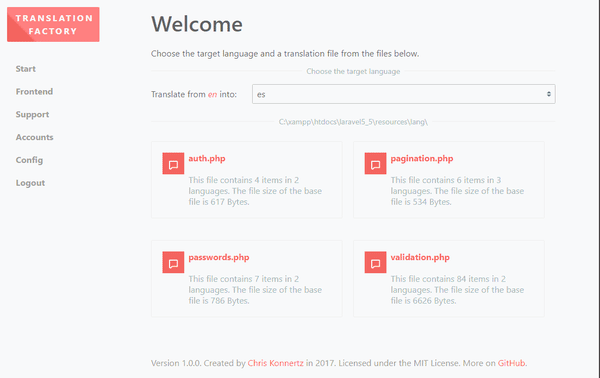

# Laravel Translation Factory

[](https://packagist.org/packages/chriskonnertz/translation-factory)
[](https://raw.githubusercontent.com/chriskonnertz/translation-factory/master/LICENSE)

Translation Factory is a tool for the Laravel framework that helps to create and manage translations.
Especially it helps to coordinate multiple translators, aiding them with AI translations.

[](dev/gifvid.gif)

> Note: "Factory" does not mean the pattern here but rather this: 🏭

## Highlights

* Seamless integration into your existing Laravel application
* Uses [DeepL](https://www.deepl.com/) - currently the best machine translation engine - to auto-translate texts
* Beautiful user interface and made with a good user experience in mind
* Well prepared for mobile devices (smartphones and tablets)
* Highly configurable and easy to extend
* Open source and free even for commercial use
 
## Installation

> This library requires PHP 7.0 or higher with the cURL extension and Laravel 5.5.

Through [Composer](https://getcomposer.org/):

```
composer require chriskonnertz/translation-factory
```
 
Publish the assets via: `php artisan vendor:publish --provider="ChrisKonnertz\TranslationFactory\Integration\TranslationFactoryServiceProvider`

Make sure Translation Factory can write into the output directories, especially you should make the
translation directory make writable, for example `resources/lang`.

If you do not want to enable support of user accounts, that's it. 
Navigate to `http://<your-domain>/translation-factory` to start. 

## Configuration

Open `config/translation_factory.php` with a text editor to change the configuration. All entries are documented.
Especially take a look at the `additional_languages` key. In this array you may add language codes of the languages 
that you want to support. Translation Factory tires to auto-detect these languages but this will only be successful if
there are at least one translation file for each of these languages, so better add them to the array.

## User Accounts With Laravel

This package supports user authentication. Per default it depends on Laravel's built-in user authentication system.
If you want to enable support of user accounts you have to do this in the config file (key: `user_authentication`).
You also have to add the user IDs of all administrators to the config file (key: `user_admin_ids`). 

If you already use Laravel's user authentication then you can skip the rest of this section. 
But if you have a fresh installation of Laravel follow these steps to prepare it:

1. Via console run `php artisan make:auth` to create resources like controllers and views
2. Then run `php artisan migrate` to prepare the database

Now the translators will be able to navigate to `http://<your-domain>/home` and log in or create a new user account.

> If you do not want to use Laravel's built-in user authentication system you have to create your own user manager 
that implements the `UserManagerInterface`. Introduce it to Translation Factory by adding its name to the config file
(key: `user_manager`).

## Use With External Translators

If you want to use Translation Factory to let external translators translate your texts, it is recommended to follow these steps:

1. Setup a new server with your application. The server has to be reachable from the outside
2. Make sure Translation Factory can write into the output directories
3. Configure everything, especially enable user authentication
4. Create your own account and then add id to the admins list in the config file
5. Let the externals create their user accounts (`http://<your-domain>/register`)
6. Activate the accounts of the translators
7. Spread the link: `http://<your-domain>/translation-factory`

## Backups

The default behaviour of Translation Factory is to make daily backups of all translation files
 that it wants to overwrite. They will be stored in `<storage-path>/app/translations` which usually
 translates to `storage/app/translations`. You may change this path in the config file (key: `backup_dir`). 
 The names of the backup files will be built of a hash and the date and use ".backup" as extension.

## Current State

This is an MVP (minimum viable product). The code quality is okay, but for sure it is not great. 
There is a lot of space for refactoring. Refactoring will be done if it turns out that this package actually meets 
someones needs. 

## FAQ

* **Which languages can be auto-translated?** Here is a list: [Link](https://github.com/chriskonnertz/DeepLy#supported-languages)
* **Why are characters missing in the auto-translation?** This is an issue of DeepL. Always verify the auto-translations!
* **Does this also work with Laravel 5.4?** Maybe. Not tested, though. You would have to register the `TranslationFactoryServiceProvider`.
* **Should I use [barryvdh/laravel-translation-manager](https://github.com/barryvdh/laravel-translation-manager)?**
LTM offers some features that help to handle translations, for example finding translations that are missing in the
translations files. That makes it a good addition to Translation Factory. Translation Factory on the other hand is
 focused on translating. It has a sophisticated user interface and uses DeepL to help the translator, which makes it a
 good choice for translating.
* **I got this exception: "SQLSTATE[42000]: Syntax error or access violation: 1071 Specified key was too long; max key length is 767 bytes"**
Here is a solution: [Link](https://laravel-news.com/laravel-5-4-key-too-long-error)
